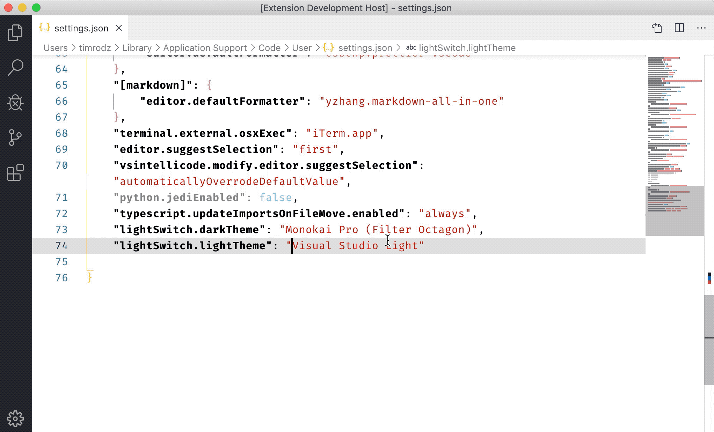
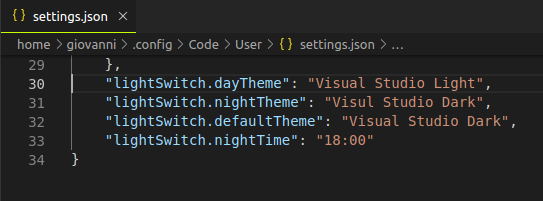
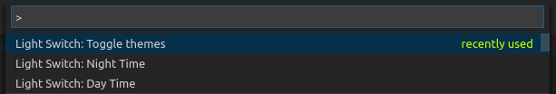

# 💡 Light Switch 💡

Light Switch allows you to set-up two themes that swap around day & night. All you have to do is pick your themes and set your preferred times.

## Features

- 🌗 Specify Day & Night themes
- ⏱ Set your desired night time

## Requirements

- [Day.js](https://day.js.org/): `npm install dayjs --save`

## Extension Settings

This extension contributes the following settings:

- `lightSwitch.defaultTheme`: Default theme in case that loading fails.
- `lightSwitch.nightTheme`: Theme that will be set during dark mode.
- `lightSwitch.dayTheme`: Theme that will be set during light mode.
- `lightSwitch.nightTime`: 24-hour local time that activates night mode. Format: HH:mm (i.e. 20:00, 10:30, 03:45).

Example:

## Quick Actions

Quickly change the theme (default: ctrl + shift + p)

## Known Issues

Calling out known issues can help limit users opening duplicate issues against your extension.

## Running locally

### Structure

All code lives inside `src/`:

- `commands`: Every command goes here - Includes the generic command binder.
- `test`: All kinds of tests will be run here. [Read more on testing](https://code.visualstudio.com/api/working-with-extensions/testing-extension).
- `util`: General utilities
  - `date`: Date conversion with `day.js`.
  - `workspace`: Basic functions for getting important workspace information.

1. Run `npm install`
2. Head to the debugging area and choose either `Run Extension` or `Extension Tests` if you want to run the tests.

### Installing local builds

1. Run `vsce package`.
2. Run `code --install-extension lightswitch-VERSION.vsix` (replace `VERSION` with the **current** version number i.e. `0.1.0` or `1.0.0`).
3. Reload your window.

## Contributions

[See our contribution guidelines](CONTRIBUTING.md)
